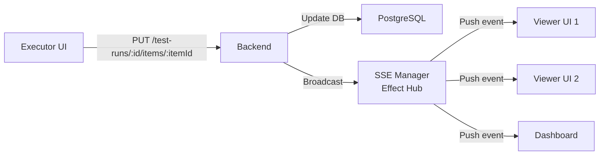
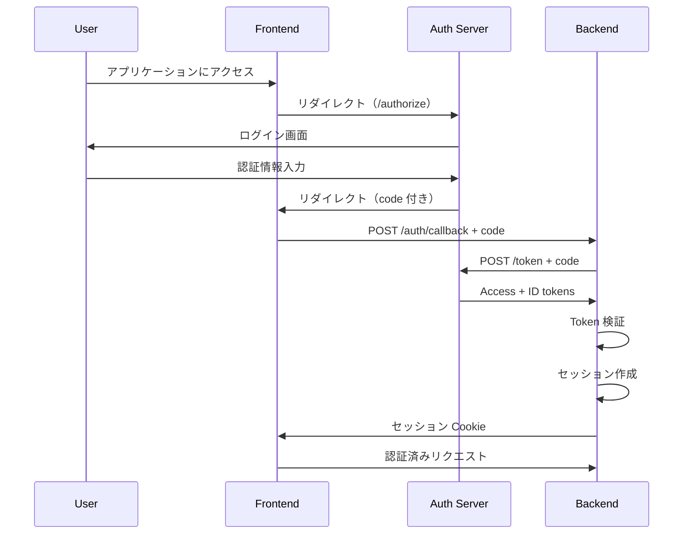

# アーキテクチャ

medi-test は、テスト管理ドメインの複雑さを管理するために **Effect TS** と **ドメイン駆動設計（DDD）** を採用しています。レイヤードアーキテクチャと Port/Adapter パターンにより、ビジネスルールの独立性と変更容易性を確保します。

## レイヤー構成

- Presentation: UI とユーザー操作
- Application: ユースケースと Port 定義
- Domain: ビジネスルールとドメインモデル
- Infrastructure: 外部依存の実装

## 依存方向

- Presentation → Application → Domain
- Infrastructure → Application → Domain

Domain と Application は下位レイヤーに依存しません。

## adapter と hook の役割

- adapter はユースケースの呼び出しと Effect の実行を担当
- hook は UI の状態管理と adapter の呼び出しを担当

## エラー設計

- Domain Error: ビジネスルール違反
- Shared Error: ネットワークや認可など技術的エラー
- Presentation ではタグごとにメッセージへ変換して表示

---

## ハイブリッドストレージ戦略

medi-test は、データの特性に応じて **Git** と **PostgreSQL** を使い分けます。

### Git（テストシナリオ）

**用途**: テストシナリオの定義（YAML/Markdown）

**理由**:

- バージョン管理が必須（シナリオの変更履歴を追跡）
- コードレビュー（GitHub PR）との統合
- 監査証跡（誰が、いつ、何を変更したか）
- ブランチ戦略（feature ブランチで新規シナリオを開発）

**データ特性**:

- 不変（一度作成したら変更は新しいコミットとして記録）
- 読み取り中心（テスト実行時に読み取り）
- 検索は Grep/Ripgrep で十分

### PostgreSQL（テスト実行結果）

**用途**: テストランと実行結果の管理

**理由**:

- リアルタイム更新が必要（複数ユーザーが同時に結果を入力）
- 複雑なクエリと集計（合格率、失敗傾向の分析）
- ACID トランザクション（データ整合性の保証）
- SSE との相性（PostgreSQL LISTEN/NOTIFY や定期ポーリング）

**データ特性**:

- 可変（テスト結果は随時更新）
- 読み書き均等（実行中は書き込み、完了後は読み取り）
- SQL インデックスによる高速検索

### バージョニング戦略

テストラン作成時に Git commit SHA を保存することで、テスト実行時のシナリオバージョンを固定します。

```typescript
// TestRunItem に Git commit SHA を保存
interface TestRunItem {
  scenario_id: string;
  scenario_version: string; // Git commit SHA
  // ...
}
```

これにより、テスト実行後にシナリオが更新されても、実行時の定義を正確に参照できます。

**詳細**: [ストレージアーキテクチャ](storage-architecture.md)

---

## 外部連携アーキテクチャ

### GitHub Integration

**目的**: リリース候補の検出とテスト範囲の自動提案

**フロー**:

1. PR にカスタムラベル（例: `release: v2.1.0`）を付与
2. GitHub API で該当ラベルの PR を検索
3. PR の変更ファイルリストを取得
4. ファイルパスをテストカテゴリにマッピング
5. 該当カテゴリのシナリオを推薦

**Port 定義**:

```typescript
export class GitHubClient extends Context.Tag("@services/GitHubClient")<
  GitHubClient,
  {
    getPRsByLabel: (label: string) => Effect.Effect<PR[], GitHubError>;
    getChangedFiles: (
      prNumber: number,
    ) => Effect.Effect<ChangedFile[], GitHubError>;
  }
>() {}
```

**Adapter 実装**: Octokit（GitHub REST API クライアント）

### Linear Integration

**目的**: Issue 情報の取得とテスト範囲の強化

**取得情報**:

- Issue タイトル、説明、ラベル、優先度
- 関連 PR 番号（Issue 説明から抽出）
- Linear の優先度をシナリオの重要度にマッピング

**Port 定義**:

```typescript
export class LinearClient extends Context.Tag("@services/LinearClient")<
  LinearClient,
  {
    getIssue: (issueId: string) => Effect.Effect<LinearIssue, LinearError>;
    getIssues: (
      issueIds: string[],
    ) => Effect.Effect<LinearIssue[], LinearError>;
  }
>() {}
```

**Adapter 実装**: Linear GraphQL SDK

### Slack Notifications

**目的**: テストランイベントの通知

**通知トリガー**:

- テストラン開始
- テストラン完了
- Critical テスト失敗（即時通知）
- 承認待ち状態

**Port 定義**:

```typescript
export class SlackNotifier extends Context.Tag("@services/SlackNotifier")<
  SlackNotifier,
  {
    sendMessage: (message: SlackMessage) => Effect.Effect<void, SlackError>;
    notifyTestRunCompleted: (
      testRunId: string,
    ) => Effect.Effect<void, SlackError>;
    notifyCriticalTestFailed: (
      testRunId: string,
      itemId: string,
    ) => Effect.Effect<void, SlackError>;
  }
>() {}
```

**Adapter 実装**: Slack Incoming Webhook

**詳細**: [外部連携](integrations.md)

---

## リアルタイム更新（SSE）

### Why SSE?

複数ユーザーがテスト実行の進捗をリアルタイムで共有するため、**Server-Sent Events (SSE)** を採用しました。

| Feature          | SSE                            | WebSocket            |
| ---------------- | ------------------------------ | -------------------- |
| **通信方向**     | Server → Client のみ           | 双方向               |
| **プロトコル**   | HTTP                           | WebSocket protocol   |
| **再接続**       | 自動                           | 手動実装が必要       |
| **実装の複雑さ** | シンプル                       | 複雑                 |
| **ユースケース** | テスト進捗通知（読み取り専用） | チャット（読み書き） |

medi-test では、テスト進捗はサーバーからクライアントへの一方向通信であるため、SSE が最適です。

### アーキテクチャ



### Port 定義

```typescript
export class SSEBroadcaster extends Context.Tag("@services/SSEBroadcaster")<
  SSEBroadcaster,
  {
    sendUpdate: (
      testRunId: string,
      update: TestRunUpdate,
    ) => Effect.Effect<void, BroadcastError>;
    subscribeToTestRun: (
      testRunId: string,
    ) => Stream.Stream<TestRunUpdate, SubscriptionError>;
  }
>() {}
```

### Adapter 実装

Effect の `Hub` を使用して、複数のクライアントへのブロードキャストを実現します。

```typescript
export const SSEBroadcasterLive = Layer.effect(
  SSEBroadcaster,
  Effect.gen(function* () {
    const hub = yield* Hub.unbounded<TestRunUpdate>();

    return {
      sendUpdate: (testRunId, update) => Hub.publish(hub, update),
      subscribeToTestRun: (testRunId) =>
        Stream.fromHub(hub).pipe(
          Stream.filter((update) => update.testRunId === testRunId),
        ),
    };
  }),
);
```

### Use Case 統合

```typescript
export const updateTestItem = (
  testRunId: string,
  itemId: string,
  input: UpdateTestItemInput,
) =>
  Effect.gen(function* () {
    const repo = yield* TestRunRepository;
    const broadcaster = yield* SSEBroadcaster;

    // 1. データベース更新
    const updated = yield* repo.updateItem(testRunId, itemId, input);

    // 2. リアルタイム通知
    yield* broadcaster.sendUpdate(testRunId, {
      type: "item_updated",
      testRunId,
      itemId,
      data: updated,
      timestamp: new Date(),
    });

    return updated;
  });
```

**詳細**: [リアルタイム更新](real-time-updates.md)

---

## 認証・認可

### OAuth 2.0 / OIDC

medi-test は、外部 ID プロバイダー（Google、GitHub など）との統合のために **OAuth 2.0 / OIDC** を採用します。

**Authorization Code Flow**:



### ロールベースアクセス制御（RBAC）

**ユーザーロール**:

- **Admin**: すべての操作が可能
- **Executor**: シナリオ作成、テスト実行
- **Viewer**: 結果の閲覧のみ
- **Approver**: テストランの承認

**Permission Matrix**:

| Action         | Admin | Executor | Viewer | Approver |
| -------------- | ----- | -------- | ------ | -------- |
| シナリオ作成   | ✓     | ✓        | ✗      | ✗        |
| シナリオ編集   | ✓     | ✓        | ✗      | ✗        |
| テストラン作成 | ✓     | ✓        | ✗      | ✗        |
| テスト実行     | ✓     | ✓        | ✗      | ✗        |
| 結果閲覧       | ✓     | ✓        | ✓      | ✓        |
| テストラン承認 | ✓     | ✗        | ✗      | ✓        |
| ユーザー管理   | ✓     | ✗        | ✗      | ✗        |

### Permission Enforcement

**Domain Model**:

```typescript
export interface User {
  readonly id: string;
  readonly email: string;
  readonly name: string;
  readonly roles: readonly Role[];
  readonly status: UserStatus;
}

export type Role = "admin" | "executor" | "viewer" | "approver";
```

**Application Layer でのチェック**:

```typescript
export const createScenario = (input: CreateScenarioInput) =>
  Effect.gen(function* () {
    const currentUser = yield* CurrentUser;

    // Permission check
    yield* Effect.when(!hasPermission(currentUser, "scenario:create"), () =>
      Effect.fail(
        new UnauthorizedError({
          action: "scenario:create",
          userId: currentUser.id,
        }),
      ),
    );

    // シナリオ作成処理
    // ...
  });
```

**詳細**: [認証・認可](authentication.md)

---

## マルチプロジェクトと環境

### Project と Environment の関係

```
Project (medimo-web)
  ├── Environment: production
  │   ├── Scenarios: auth/, payment/, ui/
  │   └── Test Runs
  └── Environment: staging
      ├── Scenarios: auth/, payment/, ui/
      └── Test Runs
```

### Domain Model

```typescript
export interface Project {
  readonly id: string;
  readonly key: string; // "medimo-web", "medimo-api"
  readonly name: string;
  readonly environments: readonly Environment[];
}

export interface Environment {
  readonly id: string;
  readonly projectId: string;
  readonly name: string; // "production", "staging"
  readonly gitRepository: string;
  readonly gitBranch: string;
}
```

### テストランの環境管理

- テストランは特定の **Project + Environment** に紐づく
- シナリオは環境ごとに Git リポジトリの異なるディレクトリに配置
- レポートとダッシュボードは環境単位でフィルタ可能

---

## 将来拡張

### 自動テスト結果の取り込み

**拡張ポイント**:

1. **Port 定義**: `AutomatedTestRunner` Tag
2. **Adapter 実装**: CI/CD システム（GitHub Actions、Jenkins）との統合
3. **Use Case**: `importAutomatedTestResults`

**実装の余地を残す設計**:

- TestRunItem の `result` フィールドは文字列型（新しいステータスを追加可能）
- `evidence` フィールドは JSONB（任意の構造を保存可能）
- シナリオファイルに `automated_test_id` フィールドを追加可能

---

## 関連ドキュメント

- **[ストレージアーキテクチャ](storage-architecture.md)** - Git + PostgreSQL のハイブリッド戦略の詳細
- **[外部連携](integrations.md)** - GitHub、Linear、Slack の統合実装
- **[リアルタイム更新](real-time-updates.md)** - SSE の実装詳細
- **[認証・認可](authentication.md)** - OAuth 2.0 / OIDC + RBAC の実装
- **[データモデル](data-model.md)** - エンティティとリレーションシップ
- **[実装ガイド](implementation-guide.md)** - Effect TS の実装パターン
