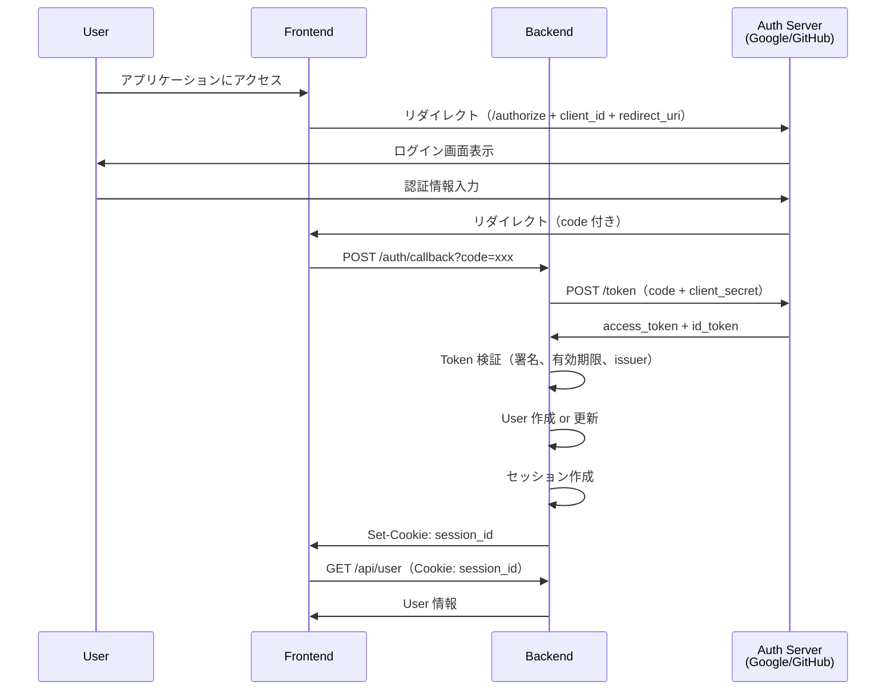

# 認証・認可

medi-test は、**OAuth 2.0 / OIDC** による認証と、**ロールベースアクセス制御（RBAC）** による認可を実装します。

---

## OAuth 2.0 / OIDC Flow

### Authorization Code Flow



### Token Validation

**JWT（JSON Web Token）の検証**:
1. **署名検証**: Auth Server の公開鍵で署名を検証
2. **有効期限チェック**: `exp` claim が現在時刻より後か
3. **Issuer 検証**: `iss` claim が期待する Auth Server か
4. **Audience 検証**: `aud` claim が自アプリケーションか

```typescript
// infrastructure/adapters/auth-adapter.ts
import * as jose from "jose";
import { Effect } from "effect";

export const validateToken = (token: string, publicKey: jose.KeyLike) =>
  Effect.tryPromise({
    try: () =>
      jose.jwtVerify(token, publicKey, {
        issuer: "https://accounts.google.com",
        audience: "your-client-id"
      }),
    catch: (error) =>
      new TokenValidationError({
        message: "Token validation failed",
        cause: error
      })
  });
```

### Session Management

**セッション保存先**:
- PostgreSQL（推奨: スケーラブル、永続化）
- Redis（オプション: 高速、TTL 管理が容易）

**セッションスキーマ**:
```sql
CREATE TABLE sessions (
  id UUID PRIMARY KEY DEFAULT gen_random_uuid(),
  user_id UUID NOT NULL REFERENCES users(id),
  access_token TEXT NOT NULL,
  refresh_token TEXT,
  expires_at TIMESTAMPTZ NOT NULL,
  created_at TIMESTAMPTZ DEFAULT NOW()
);

CREATE INDEX idx_sessions_user ON sessions(user_id);
CREATE INDEX idx_sessions_expires ON sessions(expires_at);
```

**セッション更新**:
- Access token の有効期限切れ前に自動更新
- Refresh token で新しい access token を取得

---

## ロールベースアクセス制御（RBAC）

### ユーザーロール

| Role | 説明 | 主な用途 |
|------|------|----------|
| **Admin** | 管理者 | すべての操作、ユーザー管理、設定変更 |
| **Executor** | 実行者 | シナリオ作成・編集、テスト実行 |
| **Viewer** | 閲覧者 | テスト結果の閲覧のみ |
| **Approver** | 承認者 | テストランの承認、結果閲覧 |

**複数ロール**: 1 ユーザーが複数ロールを持つことが可能（例: Executor + Approver）

### Permission Matrix

| Action | Admin | Executor | Viewer | Approver |
|--------|:-----:|:--------:|:------:|:--------:|
| **シナリオ** |
| シナリオ作成 | ✓ | ✓ | ✗ | ✗ |
| シナリオ編集 | ✓ | ✓ | ✗ | ✗ |
| シナリオアーカイブ | ✓ | ✗ | ✗ | ✗ |
| **テストラン** |
| テストラン作成 | ✓ | ✓ | ✗ | ✗ |
| テスト実行 | ✓ | ✓ | ✗ | ✗ |
| テストラン承認 | ✓ | ✗ | ✗ | ✓ |
| **閲覧** |
| テスト結果閲覧 | ✓ | ✓ | ✓ | ✓ |
| レポート表示 | ✓ | ✓ | ✓ | ✓ |
| **管理** |
| ユーザー管理 | ✓ | ✗ | ✗ | ✗ |
| プロジェクト設定 | ✓ | ✗ | ✗ | ✗ |
| 統合設定（GitHub/Linear/Slack） | ✓ | ✗ | ✗ | ✗ |

### Domain Model

```typescript
// domain/models/user.ts
import { Data } from "effect";

export type Role = "admin" | "executor" | "viewer" | "approver";

export type UserStatus = "active" | "inactive" | "suspended";

export class User extends Data.Class<{
  readonly id: string;
  readonly email: string;
  readonly name: string;
  readonly avatarUrl: string | null;
  readonly roles: readonly Role[];
  readonly status: UserStatus;
  readonly createdAt: Date;
  readonly updatedAt: Date;
}> {}

export type Permission =
  | "scenario:create"
  | "scenario:edit"
  | "scenario:archive"
  | "test-run:create"
  | "test-run:execute"
  | "test-run:approve"
  | "test-run:view"
  | "user:manage"
  | "project:configure";
```

### Permission Check Logic

```typescript
// domain/logic/permission-checker.ts
import type { User, Role, Permission } from "../models/user";

const rolePermissions: Record<Role, readonly Permission[]> = {
  admin: [
    "scenario:create",
    "scenario:edit",
    "scenario:archive",
    "test-run:create",
    "test-run:execute",
    "test-run:approve",
    "test-run:view",
    "user:manage",
    "project:configure"
  ],
  executor: [
    "scenario:create",
    "scenario:edit",
    "test-run:create",
    "test-run:execute",
    "test-run:view"
  ],
  viewer: ["test-run:view"],
  approver: ["test-run:view", "test-run:approve"]
};

export const hasPermission = (user: User, permission: Permission): boolean => {
  if (user.status !== "active") {
    return false;
  }

  return user.roles.some((role) => rolePermissions[role].includes(permission));
};

export const requirePermission = (user: User, permission: Permission): boolean => {
  if (!hasPermission(user, permission)) {
    throw new UnauthorizedError({
      userId: user.id,
      permission,
      message: `User does not have permission: ${permission}`
    });
  }
  return true;
};
```

---

## Permission Enforcement

### Application Layer

Use Case でパーミッションチェックを実行:

```typescript
// application/usecases/scenario/create-scenario.ts
import { Effect } from "effect";
import { CurrentUser } from "~/application/ports/current-user";
import { GitRepository } from "~/application/ports/git-repository";
import { hasPermission } from "~/domain/logic/permission-checker";
import { UnauthorizedError } from "~/domain/errors/auth-errors";

export const createScenario = (input: CreateScenarioInput) =>
  Effect.gen(function* () {
    const currentUser = yield* CurrentUser;

    // Permission check
    if (!hasPermission(currentUser, "scenario:create")) {
      yield* Effect.fail(
        new UnauthorizedError({
          action: "scenario:create",
          userId: currentUser.id,
          message: "シナリオを作成する権限がありません"
        })
      );
    }

    // シナリオ作成処理
    const gitRepo = yield* GitRepository;
    const yaml = yield* generateScenarioYAML(input);
    const markdown = yield* generateScenarioMarkdown(input);

    yield* gitRepo.commitFiles([
      { path: `scenarios/${input.id}.yml`, content: yaml },
      { path: `scenarios/${input.id}.md`, content: markdown }
    ]);

    return { id: input.id, version: yield* gitRepo.getCurrentCommit() };
  });
```

### Infrastructure Layer

Token 検証とユーザー情報の取得:

```typescript
// infrastructure/adapters/auth-adapter.ts
import { Effect, Layer, Context } from "effect";
import * as jose from "jose";
import { AuthService, TokenValidationError } from "~/application/ports/auth-service";
import { User } from "~/domain/models/user";

export class AuthConfig extends Context.Tag("@config/AuthConfig")<
  AuthConfig,
  {
    issuer: string;
    audience: string;
    publicKey: jose.KeyLike;
  }
>() {}

export const AuthServiceLive = Layer.effect(
  AuthService,
  Effect.gen(function* () {
    const config = yield* AuthConfig;

    return AuthService.of({
      validateToken: (token) =>
        Effect.gen(function* () {
          const decoded = yield* Effect.tryPromise({
            try: () =>
              jose.jwtVerify(token, config.publicKey, {
                issuer: config.issuer,
                audience: config.audience
              }),
            catch: (error) =>
              new TokenValidationError({
                message: "Token validation failed",
                cause: error
              })
          });

          return {
            userId: decoded.payload.sub!,
            email: decoded.payload.email as string,
            name: decoded.payload.name as string
          };
        }),

      refreshToken: (refreshToken) =>
        Effect.gen(function* () {
          // Refresh token logic
          // ...
        })
    });
  })
);
```

### Presentation Layer（Middleware）

React Router の loader/action でセッションチェック:

```typescript
// app/middleware/auth.ts
import { redirect } from "react-router";
import { getSession } from "~/lib/session";

export async function requireAuth(request: Request) {
  const session = await getSession(request.headers.get("Cookie"));

  if (!session) {
    throw redirect("/login");
  }

  return session;
}

export async function requirePermission(
  request: Request,
  permission: Permission
) {
  const session = await requireAuth(request);
  const user = session.user;

  if (!hasPermission(user, permission)) {
    throw new Response("Forbidden", { status: 403 });
  }

  return user;
}
```

**Page での使用例**:
```typescript
// pages/scenarios/new.tsx
import type { LoaderFunctionArgs } from "react-router";
import { requirePermission } from "~/middleware/auth";

export async function loader({ request }: LoaderFunctionArgs) {
  // シナリオ作成権限をチェック
  const user = await requirePermission(request, "scenario:create");

  return { user };
}

export default function NewScenarioPage() {
  // ...
}
```

---

## User Management

### Admin によるユーザー管理

**機能**:
- ユーザーの招待（メール送信）
- ロールの割り当て・変更
- ユーザーの有効化・無効化
- ユーザーの削除（論理削除）

### Users テーブル

```sql
CREATE TABLE users (
  id UUID PRIMARY KEY DEFAULT gen_random_uuid(),
  email VARCHAR(255) UNIQUE NOT NULL,
  name VARCHAR(200) NOT NULL,
  avatar_url TEXT,
  roles TEXT[] NOT NULL DEFAULT '{}',  -- {"executor", "viewer"}
  status VARCHAR(20) NOT NULL DEFAULT 'active',  -- active, inactive, suspended
  oauth_provider VARCHAR(50),  -- google, github
  oauth_provider_id VARCHAR(255),
  created_at TIMESTAMPTZ DEFAULT NOW(),
  updated_at TIMESTAMPTZ DEFAULT NOW()
);

CREATE INDEX idx_users_email ON users(email);
CREATE INDEX idx_users_status ON users(status);
```

---

## Security Considerations

1. **Token 保存**
   - Access token は短期間（1時間）
   - Refresh token は長期間（30日）
   - Refresh token は HttpOnly Cookie で保存

2. **CSRF 対策**
   - SameSite=Strict Cookie
   - CSRF トークンの検証

3. **XSS 対策**
   - HttpOnly Cookie（JavaScript からアクセス不可）
   - Content Security Policy（CSP）ヘッダー

4. **セッション管理**
   - セッションの有効期限管理
   - ログアウト時にセッションを削除
   - 不正アクセス検知時にセッション無効化

5. **監査ログ**
   - すべての認証・認可イベントをログ記録
   - 失敗したログイン試行を追跡

---

## 環境変数

```bash
# .env
OAUTH_CLIENT_ID=your-google-client-id
OAUTH_CLIENT_SECRET=your-google-client-secret
OAUTH_REDIRECT_URI=http://localhost:5173/auth/callback
OAUTH_ISSUER=https://accounts.google.com
SESSION_SECRET=your-session-secret-key
```

---

## 関連ドキュメント

- [アーキテクチャ](architecture.md) - 認証・認可のアーキテクチャ概要
- [実装ガイド](implementation-guide.md) - Effect TS での実装パターン
- [データモデル](data-model.md) - User エンティティの詳細
