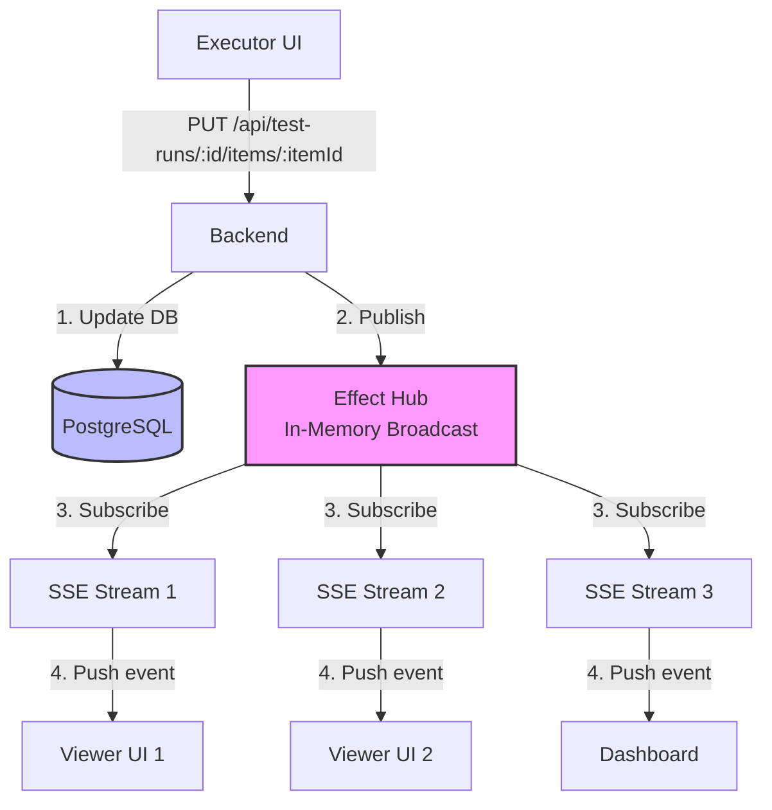

# リアルタイム更新（SSE）

medi-test は、**Server-Sent Events (SSE)** を使用して、複数ユーザーがテスト実行の進捗をリアルタイムで共有します。

---

## Why SSE for Test Progress Updates?

### SSE vs WebSocket

| Feature              | SSE                            | WebSocket                    |
| -------------------- | ------------------------------ | ---------------------------- |
| **通信方向**         | Server → Client のみ           | 双方向                       |
| **プロトコル**       | HTTP/HTTPS                     | WebSocket protocol           |
| **再接続**           | 自動（built-in）               | 手動実装が必要               |
| **ブラウザサポート** | すべてのモダンブラウザ         | すべてのモダンブラウザ       |
| **実装の複雑さ**     | シンプル                       | 複雑                         |
| **接続状態**         | HTTP long-polling              | 永続的な双方向接続           |
| **ユースケース**     | テスト進捗通知（読み取り専用） | チャット、ゲーム（読み書き） |

**medi-test の選択理由**:

- テスト進捗は**サーバーからクライアントへの一方向通信**
- クライアントはテスト結果を REST API で更新（SSE は不要）
- 自動再接続機能により、ネットワーク障害から自動復旧
- 実装がシンプルで、デバッグが容易

---

## アーキテクチャ



**フロー**:

1. Executor が REST API でテスト結果を更新
2. Backend が PostgreSQL にデータを保存
3. Backend が Effect Hub にイベントを publish
4. Hub から複数の SSE Stream にブロードキャスト
5. 各クライアントがイベントを受信し、UI を更新

---

## Port 定義

```typescript
// application/ports/sse-broadcaster.ts
import { Context, Effect, Stream, Data } from "effect";

export class BroadcastError extends Data.TaggedError("BroadcastError")<{
  message: string;
  cause?: unknown;
}> {}

export class SubscriptionError extends Data.TaggedError("SubscriptionError")<{
  message: string;
  cause?: unknown;
}> {}

export interface TestRunUpdate {
  readonly type: "item_updated" | "status_changed" | "comment_added";
  readonly testRunId: string;
  readonly itemId?: string;
  readonly data: unknown;
  readonly timestamp: Date;
}

export class SSEBroadcaster extends Context.Tag("@services/SSEBroadcaster")<
  SSEBroadcaster,
  {
    /**
     * テストラン更新イベントを送信
     */
    sendUpdate: (
      testRunId: string,
      update: TestRunUpdate,
    ) => Effect.Effect<void, BroadcastError>;

    /**
     * 特定のテストランの更新を購読
     */
    subscribeToTestRun: (
      testRunId: string,
    ) => Stream.Stream<TestRunUpdate, SubscriptionError>;
  }
>() {}
```

---

## Infrastructure 実装

### Effect Hub を使用したブロードキャスト

```typescript
// infrastructure/adapters/sse-adapter.ts
import { Effect, Layer, Hub, Stream } from "effect";
import {
  SSEBroadcaster,
  type TestRunUpdate,
} from "~/application/ports/sse-broadcaster";

export const SSEBroadcasterLive = Layer.effect(
  SSEBroadcaster,
  Effect.gen(function* () {
    // Hub for broadcasting to multiple subscribers
    const hub = yield* Hub.unbounded<TestRunUpdate>();

    return SSEBroadcaster.of({
      sendUpdate: (testRunId, update) => Hub.publish(hub, update),

      subscribeToTestRun: (testRunId) =>
        Stream.fromHub(hub).pipe(
          Stream.filter((update) => update.testRunId === testRunId),
        ),
    });
  }),
);
```

---

## Use Case 統合

### テスト結果更新時にブロードキャスト

```typescript
// application/usecases/test-run/update-test-item.ts
import { Effect } from "effect";
import { TestRunRepository } from "~/application/ports/test-run-repository";
import { SSEBroadcaster } from "~/application/ports/sse-broadcaster";

export const updateTestItem = (
  testRunId: string,
  itemId: string,
  input: UpdateTestItemInput,
) =>
  Effect.gen(function* () {
    const repo = yield* TestRunRepository;
    const broadcaster = yield* SSEBroadcaster;

    // 1. データベース更新
    const updated = yield* repo.updateItem(testRunId, itemId, input);

    // 2. リアルタイム通知をブロードキャスト
    yield* broadcaster.sendUpdate(testRunId, {
      type: "item_updated",
      testRunId,
      itemId,
      data: updated,
      timestamp: new Date(),
    });

    return updated;
  });
```

### テストランステータス変更時にブロードキャスト

```typescript
// application/usecases/test-run/update-test-run-status.ts
export const updateTestRunStatus = (testRunId: string, status: TestRunStatus) =>
  Effect.gen(function* () {
    const repo = yield* TestRunRepository;
    const broadcaster = yield* SSEBroadcaster;

    yield* repo.updateStatus(testRunId, status);

    yield* broadcaster.sendUpdate(testRunId, {
      type: "status_changed",
      testRunId,
      data: { status },
      timestamp: new Date(),
    });
  });
```

---

## Backend Endpoint (React Router)

### SSE Stream Endpoint

```typescript
// app/routes/api.test-runs.$id.stream.ts
import type { LoaderFunctionArgs } from "react-router";
import { Stream, Effect } from "effect";
import { subscribeToTestRunUpdates } from "~/application/usecases/test-run/subscribe-to-updates";
import { AppLayer } from "~/infrastructure/layers/app-layer";

export async function loader({ params }: LoaderFunctionArgs) {
  const testRunId = params.id!;

  // SSE レスポンスを返す
  const stream = new ReadableStream({
    async start(controller) {
      const program = subscribeToTestRunUpdates(testRunId).pipe(
        Stream.runForEach((update) =>
          Effect.sync(() => {
            // SSE フォーマット: "data: <JSON>\n\n"
            const data = `data: ${JSON.stringify(update)}\n\n`;
            controller.enqueue(new TextEncoder().encode(data));
          }),
        ),
        Effect.provide(AppLayer),
      );

      // Stream を実行（エラー時にクローズ）
      await Effect.runPromise(program).catch((error) => {
        console.error("SSE stream error:", error);
        controller.close();
      });
    },
  });

  return new Response(stream, {
    headers: {
      "Content-Type": "text/event-stream",
      "Cache-Control": "no-cache, no-transform",
      Connection: "keep-alive",
      "X-Accel-Buffering": "no", // Nginx buffering を無効化
    },
  });
}
```

---

## Frontend 統合

### React Hook: useTestRunUpdates

```typescript
// presentation/features/test-run/hooks/use-test-run-updates.ts
import { useEffect, useState } from "react";
import type { TestRunUpdate } from "~/application/ports/sse-broadcaster";

export const useTestRunUpdates = (testRunId: string) => {
  const [updates, setUpdates] = useState<TestRunUpdate[]>([]);
  const [connected, setConnected] = useState(false);

  useEffect(() => {
    const eventSource = new EventSource(`/api/test-runs/${testRunId}/stream`);

    eventSource.onopen = () => {
      setConnected(true);
      console.log("SSE connected");
    };

    eventSource.onmessage = (event) => {
      const update = JSON.parse(event.data) as TestRunUpdate;
      setUpdates((prev) => [...prev, update]);
    };

    eventSource.onerror = (error) => {
      console.error("SSE error:", error);
      setConnected(false);
      // ブラウザが自動的に再接続を試行
    };

    // クリーンアップ
    return () => {
      eventSource.close();
      setConnected(false);
    };
  }, [testRunId]);

  return { updates, connected };
};
```

### React Component での使用

```typescript
// presentation/features/test-run/ui/test-run-progress.tsx
import { useTestRunUpdates } from "../hooks/use-test-run-updates";

export const TestRunProgress = ({ testRunId }: { testRunId: string }) => {
  const { updates, connected } = useTestRunUpdates(testRunId);

  return (
    <div>
      <div className="flex items-center gap-2">
        <div className={cn(
          "w-2 h-2 rounded-full",
          connected ? "bg-green-500" : "bg-red-500"
        )} />
        <span className="text-sm text-gray-600">
          {connected ? "リアルタイム更新中" : "接続中..."}
        </span>
      </div>

      <div className="mt-4">
        <h3 className="text-lg font-semibold">最近の更新</h3>
        <ul className="mt-2 space-y-2">
          {updates.slice(-5).reverse().map((update, i) => (
            <li key={i} className="text-sm">
              {formatUpdate(update)}
            </li>
          ))}
        </ul>
      </div>
    </div>
  );
};

const formatUpdate = (update: TestRunUpdate): string => {
  switch (update.type) {
    case "item_updated":
      return `テストアイテム ${update.itemId} が更新されました`;
    case "status_changed":
      return `ステータスが ${update.data.status} に変更されました`;
    case "comment_added":
      return `コメントが追加されました`;
    default:
      return "更新がありました";
  }
};
```

---

## スケーリング考慮事項

### 単一サーバーインスタンス

**現在の実装（Effect Hub）**:

- In-memory で動作
- 同じサーバーインスタンスに接続しているクライアントのみ受信可能
- シンプルで低レイテンシ

**制限**:

- 複数サーバーインスタンス（水平スケーリング）には対応していない

### 複数サーバーインスタンス対応

**問題**: SSE 接続は特定のサーバーインスタンスに紐づく

**解決策**: Redis Pub/Sub でサーバー間ブロードキャスト

```typescript
// infrastructure/adapters/redis-sse-adapter.ts
import { Effect, Layer, Stream } from "effect";
import { createClient } from "redis";
import { SSEBroadcaster } from "~/application/ports/sse-broadcaster";

export const RedisSSEBroadcasterLive = Layer.effect(
  SSEBroadcaster,
  Effect.gen(function* () {
    const publisher = createClient({ url: process.env.REDIS_URL });
    const subscriber = createClient({ url: process.env.REDIS_URL });

    yield* Effect.promise(() => publisher.connect());
    yield* Effect.promise(() => subscriber.connect());

    return SSEBroadcaster.of({
      sendUpdate: (testRunId, update) =>
        Effect.tryPromise({
          try: () =>
            publisher.publish(`test-run:${testRunId}`, JSON.stringify(update)),
          catch: (error) =>
            new BroadcastError({
              message: "Failed to publish to Redis",
              cause: error,
            }),
        }).pipe(Effect.asVoid),

      subscribeToTestRun: (testRunId) => {
        const channel = `test-run:${testRunId}`;

        return Stream.async<TestRunUpdate>((emit) => {
          subscriber.subscribe(channel, (message) => {
            const update = JSON.parse(message) as TestRunUpdate;
            emit.single(update);
          });

          return Effect.sync(() => {
            subscriber.unsubscribe(channel);
          });
        });
      },
    });
  }),
);
```

**デプロイ構成**:

```
┌─────────────────────────────────────────────┐
│  Load Balancer (Sticky Session 不要)       │
└──────────┬──────────────────────────────────┘
           │
     ┌─────┴─────┐
     ↓           ↓
┌─────────┐ ┌─────────┐
│Server 1 │ │Server 2 │
└────┬────┘ └────┬────┘
     │           │
     └─────┬─────┘
           ↓
      ┌─────────┐
      │  Redis  │
      └─────────┘
```

---

## パフォーマンス最適化

### 1. イベントのバッチング

複数の更新を1つのイベントにまとめる:

```typescript
export const batchUpdates = (updates: TestRunUpdate[]): TestRunUpdate => ({
  type: "batch",
  testRunId: updates[0].testRunId,
  data: updates,
  timestamp: new Date(),
});
```

### 2. イベントフィルタリング

クライアント側で不要なイベントをフィルタ:

```typescript
eventSource.onmessage = (event) => {
  const update = JSON.parse(event.data);

  // 自分が更新したイベントは無視
  if (update.userId === currentUserId) {
    return;
  }

  setUpdates((prev) => [...prev, update]);
};
```

### 3. 接続数の制限

ブラウザの SSE 接続数制限（通常 6 接続/ドメイン）を考慮:

- 1 ページで1つの SSE 接続のみ開く
- 複数のテストランを同時に表示する場合、単一の SSE で複数のテストランを購読

---

## トラブルシューティング

### 接続が頻繁に切れる

**原因**: Proxy や Load Balancer のタイムアウト

**解決策**: Heartbeat を送信

```typescript
// Backend: 30秒ごとに heartbeat を送信
const heartbeat = setInterval(() => {
  controller.enqueue(new TextEncoder().encode(": heartbeat\n\n"));
}, 30000);
```

### 古いイベントが蓄積される

**原因**: クライアントが長時間接続し続ける

**解決策**: 定期的に reconnect

```typescript
useEffect(() => {
  const reconnectInterval = setInterval(
    () => {
      eventSource.close();
      // 再接続は自動的に行われる
    },
    5 * 60 * 1000,
  ); // 5分ごと

  return () => clearInterval(reconnectInterval);
}, []);
```

---

## 関連ドキュメント

- [アーキテクチャ](architecture.md) - SSE アーキテクチャの概要
- [実装ガイド](implementation-guide.md) - Effect TS Stream の実装パターン
- [ワークフロー](workflows.md) - リアルタイム更新のフロー図
