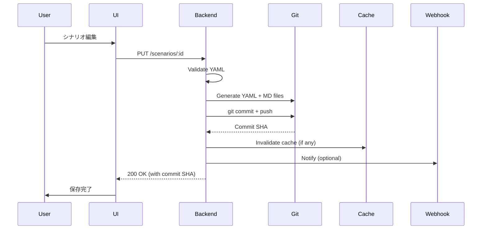

# ストレージアーキテクチャ

## 設計原則

medi-test は、データの特性に応じて **Git** と **PostgreSQL** を使い分けるハイブリッドストレージ戦略を採用しています。

### Git vs PostgreSQL の使い分け

| 観点                 | Git (Scenarios)          | PostgreSQL (Results)   |
| -------------------- | ------------------------ | ---------------------- |
| **データ特性**       | 不変、バージョン管理必要 | 可変、リアルタイム更新 |
| **アクセスパターン** | 読み取り中心             | 読み書き均等           |
| **履歴管理**         | Git の commit history    | 監査ログテーブル       |
| **スケーリング**     | 水平スケール不要         | Read replica で対応    |
| **検索**             | Grep/Ripgrep             | SQL index              |
| **トランザクション** | コミット単位             | ACID トランザクション  |
| **監査証跡**         | コミットログ、差分       | Audit log テーブル     |

### なぜこのハイブリッド戦略を採用したか

1. **シナリオのバージョン管理**
   - テストシナリオは頻繁に更新されるが、過去の版を参照する必要がある
   - Git は変更履歴、差分、ブランチ戦略、レビューフローを標準で提供
   - コードレビューツール（GitHub PR）をそのまま活用できる

2. **実行結果のリアルタイム性**
   - テスト実行結果は複数ユーザーが同時に更新・閲覧する
   - PostgreSQL は複雑なクエリ、集計、リアルタイム更新に優れている
   - SSE によるリアルタイム通知と相性が良い

3. **データの整合性**
   - シナリオ（Git）は "What to test"（テスト定義）
   - 実行結果（PostgreSQL）は "What happened"（実行履歴）
   - 明確に責任を分離することで、データモデルがシンプルになる

4. **スケーラビリティ**
   - シナリオは数百〜数千ファイル程度（Git で十分）
   - 実行結果は数万〜数百万レコード（PostgreSQL が必要）

---

## Git リポジトリ構造

### ディレクトリレイアウト

```
medi-test-scenarios/
├── projects/
│   ├── medimo-web/
│   │   ├── production/
│   │   │   ├── auth/
│   │   │   │   ├── login-001.yml
│   │   │   │   ├── login-001.md
│   │   │   │   ├── logout-002.yml
│   │   │   │   └── logout-002.md
│   │   │   ├── payment/
│   │   │   │   ├── checkout-001.yml
│   │   │   │   ├── checkout-001.md
│   │   │   │   ├── refund-002.yml
│   │   │   │   └── refund-002.md
│   │   │   └── ui/
│   │   │       ├── dashboard-001.yml
│   │   │       └── dashboard-001.md
│   │   └── staging/
│   │       ├── auth/
│   │       └── payment/
│   └── medimo-api/
│       ├── production/
│       │   ├── endpoints/
│       │   ├── integration/
│       │   └── performance/
│       └── staging/
├── templates/
│   ├── scenario-template.yml
│   ├── scenario-template.md
│   └── README.md
├── archived/
│   └── medimo-web/
│       └── production/
│           └── deprecated-feature/
└── .github/
    └── workflows/
        └── validate-scenarios.yml  # CI for YAML validation
```

### シナリオファイル命名規則

- **形式**: `{feature}-{number}.{yml|md}`
- **例**: `login-001.yml`, `login-001.md`
- **ルール**:
  - feature は kebab-case
  - number は 3 桁のゼロパディング（001, 002, ...）
  - 同じ ID の YAML と Markdown をペアで作成

---

## シナリオファイル形式

### YAML ファイル（構造化データ）

**ファイル名**: `scenario-001.yml`

```yaml
# シナリオメタデータ
id: auth-login-001
title: ユーザーログインフロー
category: authentication
tags:
  - critical
  - user-management
  - security
default_importance: high
required_by_default: true

# 前提条件
preconditions:
  - 管理者権限でログイン済み
  - テスト用データベースが初期化済み
  - テスト用ユーザー "test@example.com" が存在する

# 期待結果（簡潔な要約）
expected_results:
  - ログイン成功後、ダッシュボードにリダイレクトされる
  - セッションが作成される
  - 監査ログに記録される

# 関連情報
related_scenarios:
  - auth-logout-002
  - auth-password-reset-003
estimated_duration_minutes: 5
last_updated: "2025-01-15T10:30:00Z"
author: "yamada@example.com"
```

### YAML スキーマ定義

```yaml
$schema: http://json-schema.org/draft-07/schema#
title: Test Scenario
type: object
required:
  - id
  - title
  - category
properties:
  id:
    type: string
    pattern: "^[a-z0-9-]+$"
    description: "Unique scenario ID (kebab-case)"
  title:
    type: string
    maxLength: 200
    description: "Human-readable scenario title"
  category:
    type: string
    enum: [auth, payment, ui, api, integration, performance]
    description: "Scenario category"
  tags:
    type: array
    items:
      type: string
    description: "Flexible tags for search and filtering"
  default_importance:
    type: string
    enum: [low, medium, high, critical]
    default: medium
  required_by_default:
    type: boolean
    default: false
  preconditions:
    type: array
    items:
      type: string
  expected_results:
    type: array
    items:
      type: string
  related_scenarios:
    type: array
    items:
      type: string
      pattern: "^[a-z0-9-]+$"
  estimated_duration_minutes:
    type: integer
    minimum: 1
  last_updated:
    type: string
    format: date-time
  author:
    type: string
    format: email
```

### Markdown ファイル（手順の詳細）

**ファイル名**: `scenario-001.md`

```markdown
# ユーザーログインフロー

## 目的

ユーザーがメールアドレスとパスワードで正常にログインできることを確認する。

## 前提条件

- 管理者権限でログイン済み
- テスト用データベースが初期化済み
- テスト用ユーザー "test@example.com" が存在する

## テスト手順

1. ログインページにアクセス
   - URL: https://app.medimo.com/login
   - ページが正常に表示されることを確認

2. 認証情報を入力
   - メールアドレス: `test@example.com`
   - パスワード: `Test123!`

3. "ログイン" ボタンをクリック

4. ダッシュボードへのリダイレクトを確認
   - URL: https://app.medimo.com/dashboard
   - ユーザー名が右上に表示されることを確認

5. セッションの確認
   - ブラウザの Developer Tools で Cookie を確認
   - `session_id` が設定されていることを確認

## 期待結果

- [ ] ログインページが正常に表示される
- [ ] 認証情報を入力できる
- [ ] ログインボタンがクリックできる
- [ ] ダッシュボードにリダイレクトされる（2秒以内）
- [ ] ユーザー名 "テストユーザー" が表示される
- [ ] セッション Cookie が設定される
- [ ] 監査ログに "ログイン成功" が記録される

## 失敗時の確認事項

- エラーメッセージが表示されているか
- ネットワークエラーの有無（Developer Tools Network tab）
- バックエンドログにエラーが記録されているか

## 備考

- 初回ログイン時は 2FA 設定画面が表示される場合がある
- パスワード変更直後はセッションが再作成される
```

---

## PostgreSQL スキーマ

### 主要テーブル

#### releases テーブル

```sql
CREATE TABLE releases (
  id UUID PRIMARY KEY DEFAULT gen_random_uuid(),
  project_id UUID NOT NULL REFERENCES projects(id),
  environment VARCHAR(50) NOT NULL,  -- production, staging, etc.
  version VARCHAR(100) NOT NULL,
  release_tag VARCHAR(200),  -- e.g., "release: v2.1.0"
  github_pr_numbers INT[],
  linear_issue_ids TEXT[],
  release_notes TEXT,
  released_at TIMESTAMPTZ NOT NULL,
  created_at TIMESTAMPTZ DEFAULT NOW()
);

CREATE INDEX idx_releases_project_env ON releases(project_id, environment);
CREATE INDEX idx_releases_version ON releases(version);
```

#### test_runs テーブル

```sql
CREATE TABLE test_runs (
  id UUID PRIMARY KEY DEFAULT gen_random_uuid(),
  release_id UUID REFERENCES releases(id),
  title VARCHAR(200) NOT NULL,
  description TEXT,
  scope JSONB NOT NULL,  -- Which scenarios to run (with versions)
  status VARCHAR(50) NOT NULL DEFAULT 'pending',  -- pending, in_progress, completed, blocked
  completion_policy JSONB NOT NULL,  -- Pass criteria by importance
  assigned_to UUID[] REFERENCES users(id),
  started_at TIMESTAMPTZ,
  completed_at TIMESTAMPTZ,
  created_by UUID REFERENCES users(id),
  created_at TIMESTAMPTZ DEFAULT NOW(),
  updated_at TIMESTAMPTZ DEFAULT NOW()
);

CREATE INDEX idx_test_runs_release ON test_runs(release_id);
CREATE INDEX idx_test_runs_status ON test_runs(status);
```

**scope カラム（JSONB）の例**:

```json
{
  "git_repository": "https://github.com/medimo/scenarios",
  "git_commit": "a1b2c3d4e5f6...",
  "scenarios": [
    {
      "scenario_id": "auth-login-001",
      "scenario_version": "a1b2c3d4e5f6",
      "required": true,
      "importance": "high"
    },
    {
      "scenario_id": "payment-checkout-001",
      "scenario_version": "a1b2c3d4e5f6",
      "required": false,
      "importance": "medium"
    }
  ]
}
```

**completion_policy カラム（JSONB）の例**:

```json
{
  "critical": { "pass_rate": 100, "required_count": "all" },
  "high": { "pass_rate": 95, "required_count": null },
  "medium": { "pass_rate": 80, "required_count": null },
  "low": { "pass_rate": 50, "required_count": null }
}
```

#### test_run_items テーブル

```sql
CREATE TABLE test_run_items (
  id UUID PRIMARY KEY DEFAULT gen_random_uuid(),
  test_run_id UUID NOT NULL REFERENCES test_runs(id) ON DELETE CASCADE,
  scenario_id VARCHAR(100) NOT NULL,  -- Reference to Git file
  scenario_version VARCHAR(100) NOT NULL,  -- Git commit SHA
  scenario_title VARCHAR(200) NOT NULL,
  category VARCHAR(50) NOT NULL,
  importance VARCHAR(20) NOT NULL,  -- critical, high, medium, low
  required BOOLEAN NOT NULL DEFAULT false,
  result VARCHAR(50),  -- success, fail, not_executed, blocked, skipped
  evidence JSONB,  -- Screenshots, logs, notes
  executed_at TIMESTAMPTZ,
  executed_by UUID REFERENCES users(id),
  execution_duration_seconds INT,
  notes TEXT,
  created_at TIMESTAMPTZ DEFAULT NOW(),
  updated_at TIMESTAMPTZ DEFAULT NOW()
);

CREATE INDEX idx_test_run_items_test_run ON test_run_items(test_run_id);
CREATE INDEX idx_test_run_items_scenario ON test_run_items(scenario_id);
CREATE INDEX idx_test_run_items_result ON test_run_items(result);
```

**evidence カラム（JSONB）の例**:

```json
{
  "screenshots": [
    {
      "url": "s3://medi-test-evidence/2025-01-15/abc123.png",
      "timestamp": "2025-01-15T10:35:00Z",
      "caption": "ログイン画面"
    },
    {
      "url": "s3://medi-test-evidence/2025-01-15/def456.png",
      "timestamp": "2025-01-15T10:35:05Z",
      "caption": "ダッシュボード表示"
    }
  ],
  "logs": [
    {
      "level": "info",
      "message": "Login successful",
      "timestamp": "2025-01-15T10:35:03Z"
    },
    {
      "level": "error",
      "message": "Session creation failed",
      "timestamp": "2025-01-15T10:35:04Z"
    }
  ],
  "browser_info": {
    "user_agent": "Mozilla/5.0...",
    "viewport": "1920x1080"
  },
  "notes": "セッション作成に5秒以上かかった。パフォーマンス要調査。"
}
```

---

## シナリオバージョニング戦略

### 問題: テストラン作成時、どのバージョンのシナリオを使うか？

テストランを作成した後、シナリオが更新される可能性があります。過去のテストランは、その時点のシナリオ定義に基づいて実行されるべきです。

### 解決策: Git commit SHA を TestRunItem に保存

1. **テストラン作成時**:
   - 現在の Git commit SHA を取得
   - `test_runs.scope.git_commit` に保存
   - 各シナリオの `scenario_version` に同じ commit SHA を設定

2. **テスト実行時**:
   - `test_run_items.scenario_version` の commit SHA を使ってシナリオを取得
   - Git から特定コミットのファイルを読み取る: `git show <commit>:<path>`

3. **UI 表示時**:
   - 最新版と実行時版の差分を表示可能
   - 「このシナリオは実行後に更新されました」と警告表示

### 実装例

```typescript
// application/usecases/test-run/create-test-run.ts
import { Effect } from "effect";
import type { GitRepository } from "~/application/ports/git-repository";
import type { TestRunRepository } from "~/application/ports/test-run-repository";

export const createTestRun = (input: CreateTestRunInput) =>
  Effect.gen(function* () {
    const gitRepo = yield* GitRepository;
    const testRunRepo = yield* TestRunRepository;

    // 現在の Git commit SHA を取得
    const currentCommit = yield* gitRepo.getCurrentCommit();

    // スコープにシナリオとバージョンを含める
    const scope = {
      git_repository: input.gitRepository,
      git_commit: currentCommit,
      scenarios: input.scenarios.map((s) => ({
        scenarioId: s.id,
        scenarioVersion: currentCommit, // Git commit SHA
        required: s.required,
        importance: s.importance,
      })),
    };

    const testRun = yield* testRunRepo.create({
      releaseId: input.releaseId,
      title: input.title,
      description: input.description,
      scope,
      completionPolicy: input.completionPolicy,
      assignedTo: input.assignedTo,
    });

    return testRun;
  });
```

```typescript
// application/usecases/scenario/get-scenario-at-version.ts
import { Effect } from "effect";
import type { GitRepository } from "~/application/ports/git-repository";

export const getScenarioAtVersion = (scenarioId: string, version: string) =>
  Effect.gen(function* () {
    const gitRepo = yield* GitRepository;

    // 特定コミットのファイルを取得
    const yamlContent = yield* gitRepo.getFileAtCommit(
      version,
      `projects/${scenarioId}.yml`,
    );

    const markdownContent = yield* gitRepo.getFileAtCommit(
      version,
      `projects/${scenarioId}.md`,
    );

    return {
      yaml: yamlContent,
      markdown: markdownContent,
      version,
    };
  });
```

---

## 同期戦略

### シナリオ変更時のフロー



### コンフリクト解決

**問題**: 複数ユーザーが同じシナリオを同時に編集

**解決策**: Optimistic Locking with Commit SHA

1. **編集開始時**:
   - 現在の commit SHA を UI に渡す
   - `base_version` として保持

2. **保存時**:
   - `base_version` が現在の HEAD と一致するか確認
   - 一致しない場合、409 Conflict を返す
   - UI は差分を表示し、ユーザーに解決を促す

3. **自動マージ**:
   - 同じファイルの異なる行を編集した場合、Git が自動マージ
   - マージ失敗時は手動解決が必要

```typescript
// application/usecases/scenario/update-scenario.ts
export const updateScenario = (
  scenarioId: string,
  input: UpdateScenarioInput,
  baseVersion: string,
) =>
  Effect.gen(function* () {
    const gitRepo = yield* GitRepository;

    // 現在の HEAD を確認
    const currentHead = yield* gitRepo.getCurrentCommit();

    // Base version が古い場合、コンフリクト
    if (baseVersion !== currentHead) {
      yield* Effect.fail(
        new ScenarioConflictError({
          scenarioId,
          baseVersion,
          currentVersion: currentHead,
          message: "シナリオが他のユーザーによって更新されています",
        }),
      );
    }

    // 更新処理
    yield* gitRepo.updateFile(`scenarios/${scenarioId}.yml`, input.yaml);
    yield* gitRepo.updateFile(`scenarios/${scenarioId}.md`, input.markdown);

    const newCommit = yield* gitRepo.commit(
      `Update scenario: ${scenarioId}`,
      input.author,
    );

    yield* gitRepo.push();

    return { scenarioId, version: newCommit };
  });
```

### キャッシュ戦略

**問題**: Git からファイルを毎回読み取るのは非効率

**解決策**: PostgreSQL にシナリオメタデータのキャッシュを保存

```sql
CREATE TABLE scenario_cache (
  scenario_id VARCHAR(100) PRIMARY KEY,
  git_commit VARCHAR(100) NOT NULL,
  yaml_content TEXT NOT NULL,
  markdown_content TEXT NOT NULL,
  metadata JSONB NOT NULL,  -- Extracted from YAML
  cached_at TIMESTAMPTZ DEFAULT NOW()
);

CREATE INDEX idx_scenario_cache_commit ON scenario_cache(git_commit);
```

**キャッシュロジック**:

1. テストラン作成時、必要なシナリオをキャッシュに保存
2. Git commit SHA をキーとしてキャッシュ照会
3. キャッシュミス時のみ Git から読み取り
4. キャッシュは Git の真の情報源（Source of Truth）を補完する役割

---

## CI/CD パイプライン

### GitHub Actions でシナリオを検証

**.github/workflows/validate-scenarios.yml**:

```yaml
name: Validate Scenarios

on:
  push:
    branches: [main, develop]
  pull_request:
    branches: [main]

jobs:
  validate:
    runs-on: ubuntu-latest
    steps:
      - uses: actions/checkout@v3

      - name: Set up Python
        uses: actions/setup-python@v4
        with:
          python-version: "3.11"

      - name: Install dependencies
        run: |
          pip install pyyaml jsonschema

      - name: Validate YAML files
        run: |
          python scripts/validate_scenarios.py

      - name: Check for duplicate IDs
        run: |
          python scripts/check_duplicates.py

      - name: Lint Markdown files
        uses: DavidAnson/markdownlint-cli2-action@v11
        with:
          globs: "**/*.md"
```

**scripts/validate_scenarios.py**:

```python
import yaml
import json
from pathlib import Path
from jsonschema import validate, ValidationError

schema = json.loads(Path("templates/scenario-template.yml").read_text())

for yaml_file in Path("projects").rglob("*.yml"):
    with open(yaml_file) as f:
        data = yaml.safe_load(f)

    try:
        validate(instance=data, schema=schema)
        print(f"✓ {yaml_file}")
    except ValidationError as e:
        print(f"✗ {yaml_file}: {e.message}")
        exit(1)
```

---

## スケーリング考慮事項

### シナリオ数が増加した場合

| シナリオ数 | 対応策                           |
| ---------- | -------------------------------- |
| ~1,000     | Git そのまま                     |
| ~10,000    | Git Shallow Clone（`--depth 1`） |
| ~100,000   | Git LFS or Database へ移行検討   |

### テスト実行結果が増加した場合

| レコード数 | 対応策                                 |
| ---------- | -------------------------------------- |
| ~100万     | PostgreSQL パーティショニング不要      |
| ~1,000万   | テーブルパーティショニング（月別）     |
| ~1億+      | Read Replica + Archiving（S3/Glacier） |

---

## まとめ

### ハイブリッドストレージの利点

1. **シナリオ管理**:
   - Git の強力なバージョン管理機能を活用
   - 変更履歴、差分、レビューフローが標準で利用可能
   - 開発者に馴染みのあるツール（git, GitHub）

2. **実行結果管理**:
   - PostgreSQL の ACID トランザクション
   - 複雑なクエリと集計が高速
   - SSE との相性が良い

3. **明確な責任分離**:
   - シナリオ（Git）= What to test（不変、監査証跡）
   - 実行結果（PostgreSQL）= What happened（可変、リアルタイム）

### 関連ドキュメント

- [データモデル](data-model.md) - エンティティとリレーションシップ
- [ワークフロー](workflows.md) - シナリオのライフサイクル
- [実装ガイド](implementation-guide.md) - Git Repository Port の実装例
