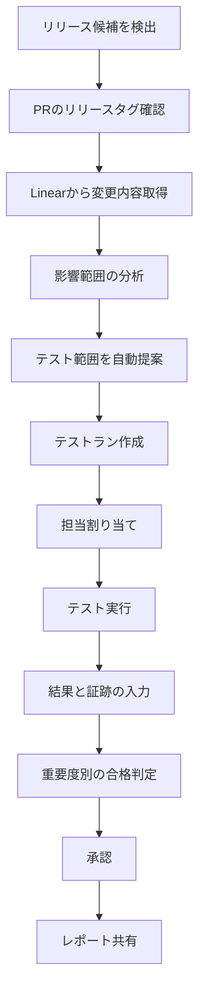
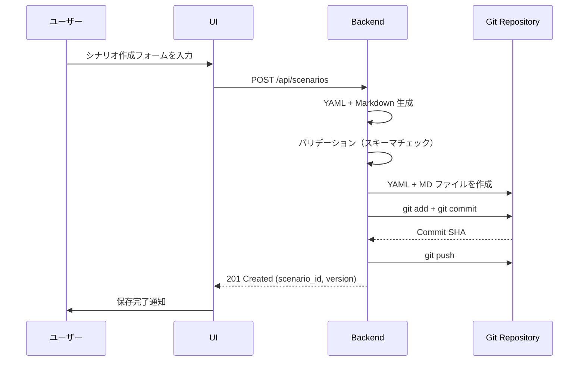
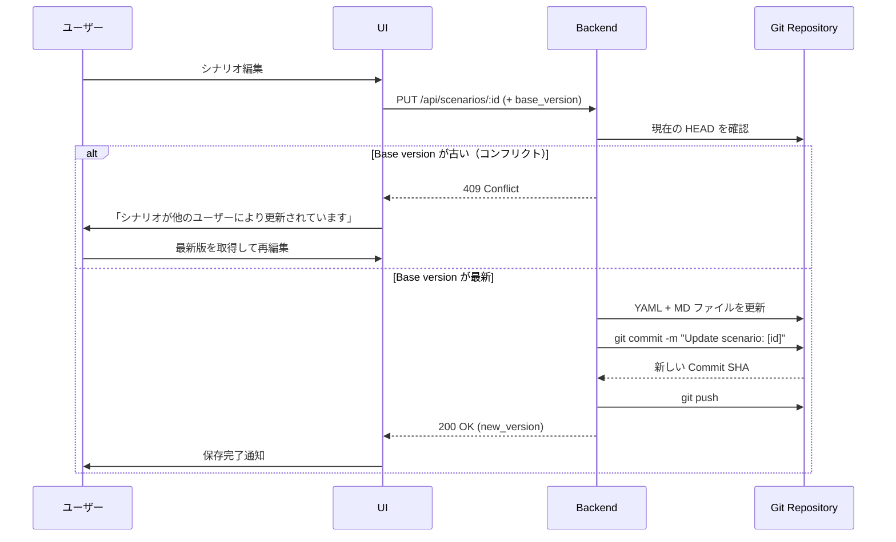
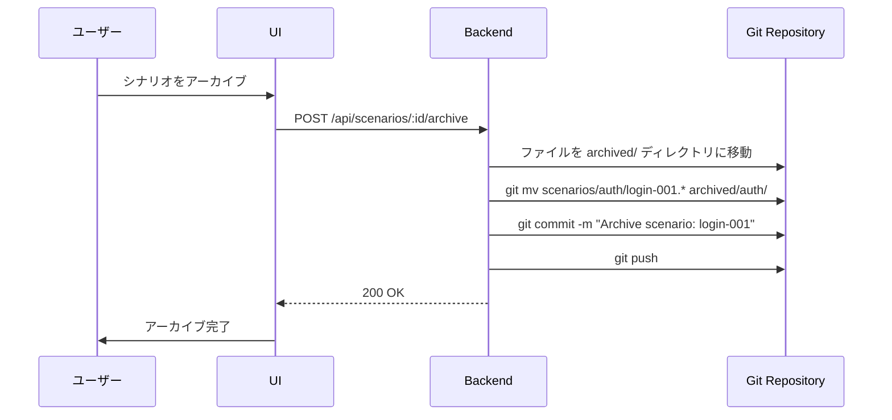
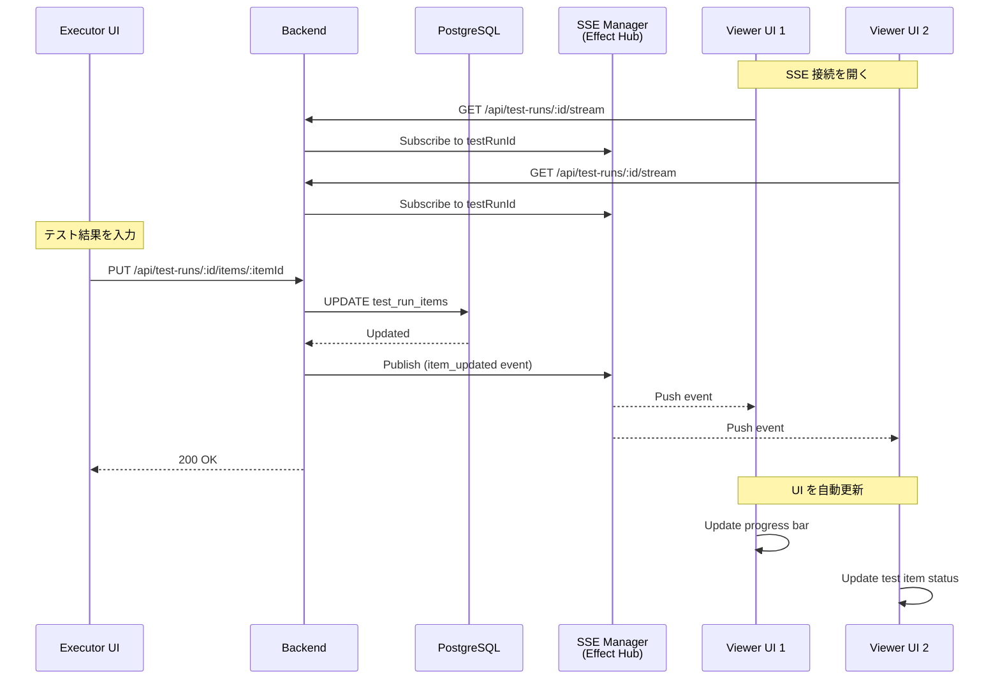
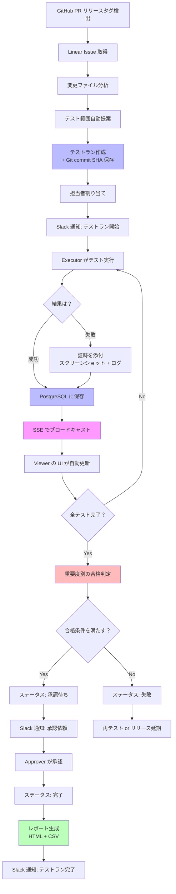
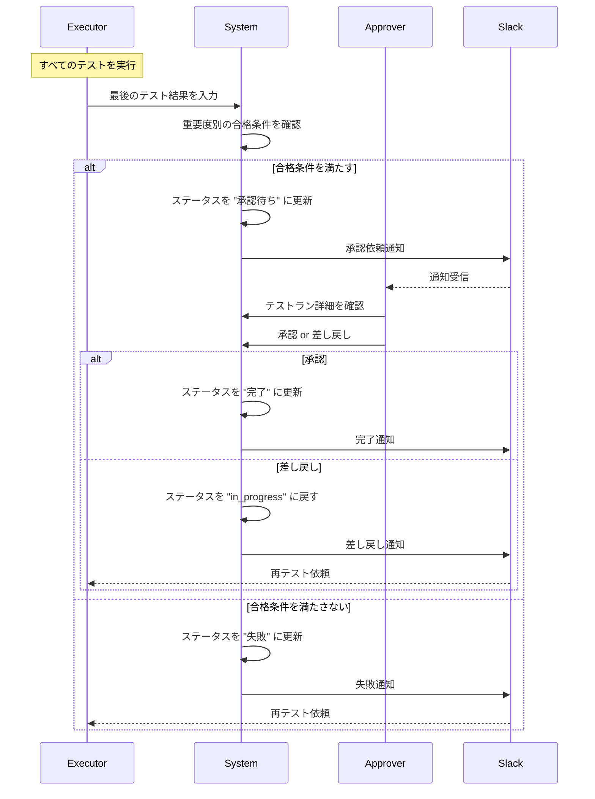
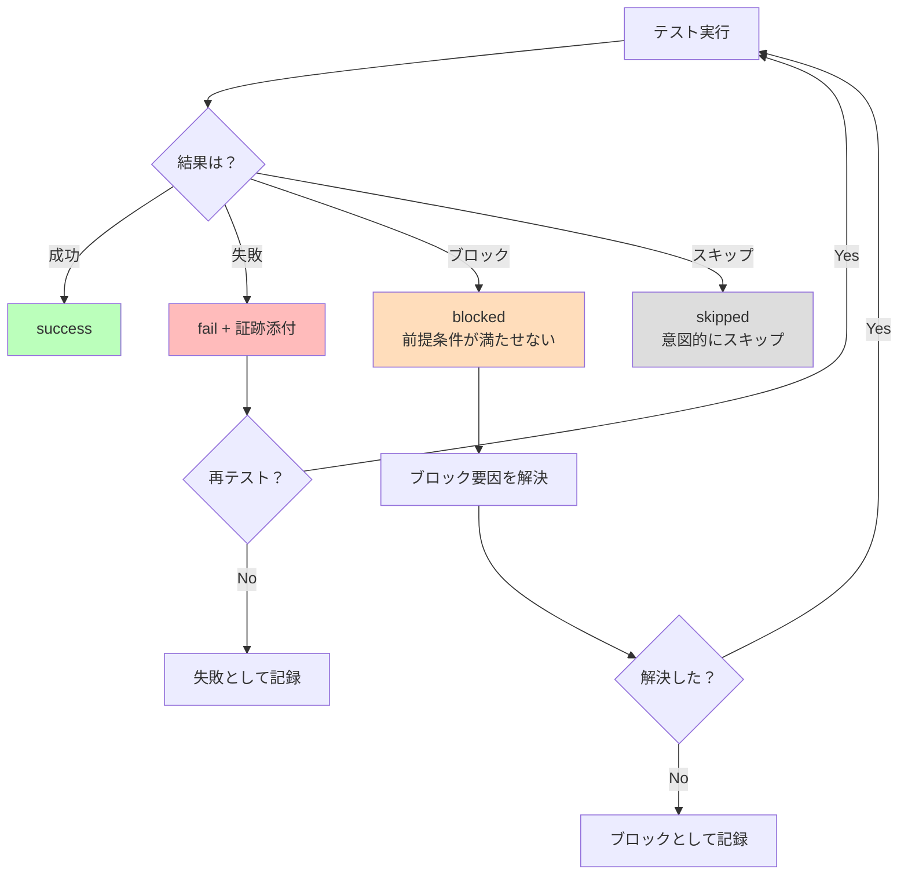

# ワークフロー

## テストフロー（想定）



## シナリオ管理

- シナリオを目的、前提条件、手順、期待結果で記述して登録
- 更新履歴を残し、過去の版を参照可能にする
- 使われなくなったシナリオはアーカイブして一覧を整理

## リリーステスト計画

- リリースやビルドごとにテストランを作成
- 対象シナリオを選定し、担当者と期限を設定
- 重要度と必須・任意で実行優先度を調整

## テスト実行と記録

- 実行者がシナリオごとに結果を記録
- 失敗時の再現手順、ログ、スクリーンショットを証跡として添付
- 進捗はリアルタイムで更新される

## 完了判定とレポート

- 重要度別の合格条件を満たすかを確認
- 未実施や失敗のシナリオを明示
- 結果レポートを共有し、監査や振り返りに活用

## テストケース作成までのプロセス

1. リリース内容の把握。PR のリリースタグと Linear 情報を収集し、変更点を整理する。ツールは関連 PR と Linear の一覧化や要約を支援できる。
2. 影響範囲の分析。変更箇所と影響ドメインを洗い出す。ツールは過去のシナリオとの関連付けや差分可視化を支援できる。
3. テスト観点の整理。重要度やリスクに応じて観点を洗い出す。ツールは観点テンプレートやチェックリストを提示できる。
4. シナリオとテストケースの設計。再利用可能な単位でケース化し、必須・任意を決める。ツールは重複検知と既存シナリオの推薦を支援できる。
5. レビューと承認。テスト内容の妥当性を確認する。ツールはレビュー依頼と承認ログの記録を支援できる。
6. テストランへの割り当て。リリース単位にまとめ、担当と期限を設定する。ツールは自動提案と一括割当を支援できる。

## このツールが支援できること

- PR と Linear を参照したテスト範囲の自動提案
- 既存シナリオの推薦と重複チェック
- 重要度と必須・任意の設定支援
- 証跡の一元管理と検索
- 進捗と完了条件の可視化

---

## シナリオのライフサイクル（Git操作）

### 新規シナリオ作成フロー



**主なステップ**:

1. ユーザーがフォームで入力（タイトル、カテゴリ、手順など）
2. Backend が YAML と Markdown を生成
3. YAML スキーマバリデーション
4. Git リポジトリにファイルを作成
5. Commit + Push（commit SHA を取得）
6. UI にシナリオ ID と version を返す

### シナリオ更新フロー（バージョニング）



**楽観的ロック（Optimistic Locking）**:

- 編集開始時に現在の commit SHA を取得（`base_version`）
- 保存時に `base_version` と現在の HEAD を比較
- 異なる場合は 409 Conflict を返し、ユーザーに再編集を促す

### シナリオアーカイブフロー



**アーカイブ戦略**:

- ファイル削除ではなく、`archived/` ディレクトリに移動
- Git 履歴により、過去のテストランからは参照可能
- UI では active シナリオのみ表示（archived は非表示）

---

## テスト実行のリアルタイム更新フロー



**SSE イベント例**:

```json
{
  "type": "item_updated",
  "testRunId": "abc123",
  "itemId": "xyz789",
  "data": {
    "result": "success",
    "executedBy": "yamada@example.com",
    "executedAt": "2025-01-15T14:30:00Z"
  },
  "timestamp": "2025-01-15T14:30:01Z"
}
```

**詳細**: [リアルタイム更新](real-time-updates.md)

---

## テストラン作成から完了までの全体フロー



---

## 承認フロー



---

## エラー処理とリトライ

### テスト実行中のエラー



---

## 関連ドキュメント

- [ストレージアーキテクチャ](storage-architecture.md) - Git リポジトリ構造の詳細
- [リアルタイム更新](real-time-updates.md) - SSE 実装の詳細
- [外部連携](integrations.md) - GitHub、Linear、Slack の統合
- [データモデル](data-model.md) - エンティティとリレーションシップ
